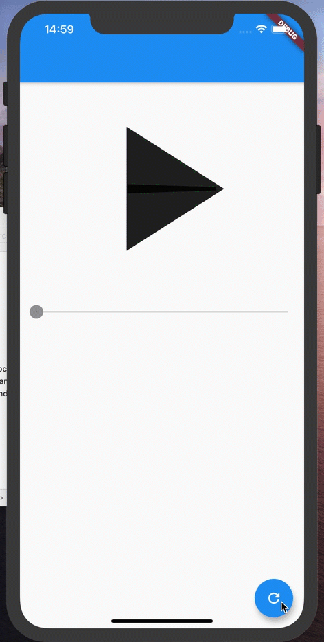

# progress_animation_builder



ProgressAnimationBuilder

## Usage

```dart
ProgressAnimationBuilder(
  value: _isInitial ? 0 : 1,
  duration: Duration(milliseconds: 1000),
  curve: Curves.slowMiddle,
  builder: (context, animation) {
    return AnimatedIcon(
      size: MediaQuery.of(context).size.width * 3 / 4,
      icon: AnimatedIcons.play_pause,
      progress: animation,
    );
  },
);
```

## Example

- https://github.com/mono0926/progress_animation_builder/tree/master/example
